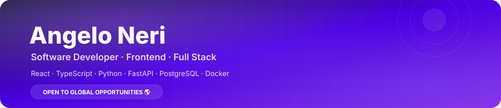

<div align="center">




<br/>


<br/><br/>

<a href="#-english">🇺🇸 English</a>
&nbsp;·&nbsp;
<a href="#-português">🇧🇷 Português</a>

</div>

---

# 🇺🇸 English

## 👋 About Me

I'm **Angelo Neri**, a Software Developer from **Feira de Santana, Bahia, Brazil**, currently completing a degree in **Systems Analysis and Development at UNIFAN**.

My focus is building **web applications, REST APIs, data-driven platforms and developer tools**.

I work mainly with **React and TypeScript** on the frontend and **Python, FastAPI and Flask** on the backend, with experience in **PostgreSQL, SQL, external API integrations, ETL, Docker and Linux**.

I also have professional experience as an **N2 IT Support Technician**, working with enterprise systems, troubleshooting, SQL/Oracle and real-world technical incidents.

### Currently focused on

- ⚛️ React + TypeScript frontend development
- 🐍 Python backend development
- 🔌 REST APIs & external integrations
- 🗄️ PostgreSQL, SQL & data pipelines
- 🐳 Docker, Linux & Git
- 🎮 Games & esports data
- 🌎 Remote and international opportunities

---

## 🧠 Tech Stack

### Frontend

<p>

</p>

**React · TypeScript · JavaScript · HTML5 · CSS3 · Tailwind CSS · Vite · Responsive UI**

### Backend

<p>

</p>

**Python · FastAPI · Flask · REST APIs · JWT · SQLAlchemy · MVC · Service Layer**

### Data & Infrastructure

<p>

</p>

**PostgreSQL · SQLite · SQL · Oracle · ETL · Docker · Docker Compose · Linux · Git · GitHub**

---

# 🚀 Featured Projects

## 🎮 PlayDB — Games & Database

<a href="https://github.com/AngeLZinS2/TCC-Game_Analytics">

</a>
<a href="https://playdb.info/">

</a>

**Python · FastAPI · React · TypeScript · PostgreSQL · Docker · ETL · REST APIs**

My main academic and engineering project: a data platform for **games and esports analytics**.

Architecture:

```text
External APIs
     ↓
Collectors
     ↓
Raw Data
     ↓
ETL / Processing
     ↓
PostgreSQL
     ↓
FastAPI
     ↓
React Dashboard
```

### Highlights

- 🎮 Steam catalog and game data
- 📊 Games & esports analytics
- 🔌 Multiple external API integrations
- 🗄️ PostgreSQL data storage
- 🔄 ETL pipelines
- 🐳 Dockerized services
- ⚡ FastAPI backend
- ⚛️ React dashboard
- 🛡️ Rate limiting and retry strategies
- 📦 Modular collector architecture

---

## 🌐 Universal Translator — Live Extension

<a href="https://github.com/AngeLZinS2/Universal-Translator-Live-Extension">

</a>

**JavaScript · Chrome Manifest V3 · WebSockets · AudioWorklet · Deepgram · Google Translate**

A browser extension for **real-time translated captions** on live streams and recorded videos.

Supports **Twitch, YouTube and Kick**, with an esports-oriented mode for gaming broadcasts.

### Highlights

- 🎙️ Real-time speech recognition
- 🌎 Automatic translation
- 🔊 Browser audio processing
- 💬 Live subtitle rendering
- ⚡ WebSocket communication
- 🎮 Esports mode
- 🧩 Manifest V3 architecture

---

## 🏥 Clínica Protheus

<a href="https://github.com/AngeLZinS2/Clinica-Protheus">

</a>

**React · Vite · Tailwind CSS · Flask · SQLAlchemy · JWT · SQLite**

Full-stack clinic management platform featuring:

- 🔐 Authentication & authorization
- 👥 Patient management
- 📅 Appointment scheduling
- 🩺 Procedures
- 📊 Dashboard
- 🔎 Search & filtering
- 📄 Pagination
- 📝 Audit logs
- 🧱 MVC + service-layer architecture

---

## 🖥️ Clinic Management API

<a href="https://github.com/AngeLZinS2/Back-End-Clinica">

</a>

**Python · Flask · SQLAlchemy · Flask-Migrate · JWT · SQLite**

REST API focused on backend architecture and business logic.

- RESTful CRUD
- JWT authentication
- Password hashing
- Validation
- Business rules
- Pagination
- Database migrations
- Layered architecture

---

## 🌱 NGO Web Platform

<a href="https://github.com/AngeLZinS2/Angular_ong_site">

</a>

**Angular · TypeScript · Flask · SQLite**

Web platform combining a modern frontend with a Python backend and database integration.

---

## 🎌 AniPT

<a href="https://github.com/AngeLZinS2/AniPT">

</a>

**Go · Bubble Tea · CLI · Open Source**

A terminal-based anime application built with Go and the Bubble Tea TUI framework.

**Open source · MIT License**

---

# 🧪 Other Projects

| Project | Technology | Focus |
| --- | --- | --- |
| [A Queda de Chimera](https://github.com/AngeLZinS2/A-Queda-de-Chimera-Game) | GDScript | 🎮 Game development |
| [Guild.Shop](https://github.com/AngeLZinS2/Guild.Shop) | TypeScript | 🎮 Gaming community management |
| [FindMe](https://github.com/AngeLZinS2/FindME_FSA) | TypeScript | 📍 Local events & discovery |
| [Espaço Vitae](https://github.com/AngeLZinS2/espaco-vitae-v2) | HTML · CSS · JS | 🌐 Institutional website |

---

# 💼 Professional Experience

### N2 IT Support — Grupo São Roque

My professional background in IT support gives me experience beyond development.

I work with:

- 🛠️ Technical troubleshooting
- 🎫 Help desk & incident management
- 🖥️ Windows environments
- 🌐 Networks
- 🔐 Active Directory / domain
- 🗄️ SQL & Oracle
- 📊 Enterprise systems
- 🏢 TOTVS Winthor
- 🔎 Incident investigation

This experience helps me understand software from both sides:

**the developer who builds it + the technical professional who supports it.**

---

# 🎓 Education

**Systems Analysis and Development**  
Centro Universitário Nobre — UNIFAN

📅 Expected completion: **2026**

---

# 🌎 Open to Global Opportunities

I'm open to:

- 🌎 International opportunities
- 💻 Remote positions
- ✈️ Relocation opportunities
- 🧑‍💻 Junior Software Developer roles
- ⚛️ Frontend Developer roles
- 🔧 Full Stack Developer roles
- 🐍 Python Developer roles

I'm especially interested in **software development, web applications, APIs, data platforms and technology products**.

---

# 📫 Let's Connect

<div align="center">

<a href="https://www.linkedin.com/in/angelo-neri-3921a72b9/">

</a>

<a href="mailto:angelo.neri2020@gmail.com">

</a>

<a href="https://github.com/AngeLZinS2">

</a>

<a href="https://playdb.info/">

</a>

<br/><br/>

**Building software. Learning continuously. Looking beyond borders. 🌎**

</div>

---

<div align="center">


</div>

---

# 🇧🇷 Português

## 👋 Sobre mim

Sou **Angelo Neri**, Desenvolvedor de Software de **Feira de Santana, Bahia, Brasil**, atualmente concluindo o curso de **Análise e Desenvolvimento de Sistemas na UNIFAN**.

Meu foco é construir **aplicações web, APIs REST, plataformas orientadas a dados e ferramentas para desenvolvedores**.

Trabalho principalmente com **React e TypeScript** no frontend e **Python, FastAPI e Flask** no backend, além de **PostgreSQL, SQL, integrações com APIs externas, ETL, Docker e Linux**.

Também possuo experiência profissional como **Suporte Técnico N2**, atuando com sistemas corporativos, troubleshooting, SQL/Oracle e incidentes reais de TI.

### Atualmente focado em

- ⚛️ Desenvolvimento frontend com React + TypeScript
- 🐍 Desenvolvimento backend com Python
- 🔌 APIs REST e integrações externas
- 🗄️ PostgreSQL, SQL e pipelines de dados
- 🐳 Docker, Linux e Git
- 🎮 Dados de games e esports
- 🌎 Oportunidades remotas e internacionais

---

## 🌎 Aberto a oportunidades globais

Tenho interesse em oportunidades de:

- Desenvolvimento de Software
- Frontend
- Full Stack
- Python
- Projetos internacionais
- Trabalho remoto
- Relocation

**Construindo software. Evoluindo continuamente. Olhando além das fronteiras. 🌎**

<div align="center">

<a href="#-english">🇺🇸 English</a>
&nbsp;·&nbsp;
<a href="#-português">🇧🇷 Português</a>

</div>
