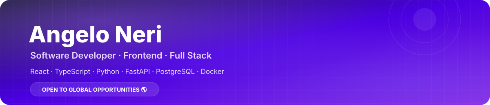

[LinkedIn](https://www.linkedin.com/in/angelo-neri-3921a72b9/) · [Email](mailto:angelo.neri2020@gmail.com) · [PlayDB](https://playdb.info/)

## 👋 About Me

I'm **Angelo Neri**, a Software Developer based in Feira de Santana, Bahia, Brazil.
I build web applications, REST APIs and data platforms, with a special interest in games and esports.
I'm open to **junior frontend, full-stack and Python development opportunities**, including remote work and relocation.

## 🛠️ Tech Stack

- **Frontend:** React · TypeScript · JavaScript · Tailwind CSS · Vite
- **Backend:** Python · FastAPI · Flask · SQLAlchemy · REST APIs
- **Data & Tools:** PostgreSQL · SQL · ETL · Docker · Linux · Git

## 🚀 Featured Projects

### 🎮 [PlayDB](https://github.com/AngeLZinS2/TCC-Game_Analytics)

Games and esports data platform connecting external APIs, ETL pipelines and an analytics dashboard. My main academic project.

**FastAPI · React · TypeScript · PostgreSQL · Docker**  
[Explore PlayDB ↗](https://playdb.info/)

### 🌐 [Universal Translator](https://github.com/AngeLZinS2/Universal-Translator-Live-Extension)

Browser extension for real-time translated captions on Twitch, YouTube and Kick, with an esports-oriented mode.

**JavaScript · Manifest V3 · WebSockets · Deepgram**

### 🏥 [Clínica Protheus](https://github.com/AngeLZinS2/Clinica-Protheus)

Full-stack clinic management platform with patient records, appointment scheduling, authentication and audit logs.

**React · Tailwind CSS · Flask · SQLAlchemy · SQLite**

[More projects on GitHub →](https://github.com/AngeLZinS2?tab=repositories)

## 💼 Background

**N2 IT Support — Grupo São Roque:** experience troubleshooting enterprise systems, working with SQL/Oracle and TOTVS Winthor, and investigating technical incidents.

**Systems Analysis and Development — UNIFAN:** expected graduation in 2026.

---

🇧🇷 Sobre mim — Português

Sou **Angelo Neri**, desenvolvedor de software de Feira de Santana, Bahia.
Construo aplicações web, APIs REST e plataformas de dados, com interesse especial em games e esports.

Trabalho com **React, TypeScript e Python**, usando FastAPI, Flask, PostgreSQL e Docker.
Meus projetos em destaque são o **PlayDB**, uma plataforma de dados de games e esports; o **Universal Translator**, uma extensão de legendas traduzidas em tempo real; e a **Clínica Protheus**, um sistema de gestão de clínicas.

Tenho experiência como **Suporte Técnico N2 no Grupo São Roque**, com sistemas corporativos, SQL/Oracle e investigação de incidentes.
Curso **Análise e Desenvolvimento de Sistemas na UNIFAN**, com conclusão prevista para 2026.

Busco oportunidades **júnior em frontend, full stack ou Python**, incluindo trabalho remoto, posições internacionais e realocação.

[LinkedIn](https://www.linkedin.com/in/angelo-neri-3921a72b9/) · [Email](mailto:angelo.neri2020@gmail.com)

